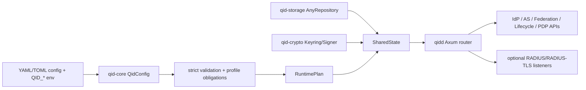

# Architecture

qid is a Rust 2024 workspace for an identity and control plane. It is intentionally larger than a single protocol daemon: qid combines IdP, authorization server, federation, lifecycle, policy, risk, audit, and operations surfaces behind one canonical configuration model.

## Product Boundary

qid's primary architecture is an identity and control plane. qpx is the most complete sister-product PEP, while the same qid-owned protocol and decision surfaces apply to other enforcement points.

| Area | qid owns | PEP/proxy/gateway owns |
| --- | --- | --- |
| Identity | users, service accounts, devices, workloads, organizations | consumes trusted identity context |
| Authentication | passkeys, password fallback, MFA, sessions, step-up | redirects, challenges, or blocks according to qid decisions |
| Authorization | OAuth/OIDC tokens, introspection, revocation, policy decisions | applies allow/deny/effects to traffic |
| Lifecycle | SCIM, HR/LDAP/AD sync, app provisioning, deprovisioning | uses trusted qid lifecycle state as enforcement input |
| Policy | RBAC/ABAC/ReBAC/PBAC inputs, risk, audit, decision TTL | enforces local policy and mapped effects |
| Data plane | consumes derived enforcement/audit context | observes protocol facts and executes routing, TLS behavior, caching, mirroring, packet capture, HTTP/3/MASQUE, and enforcement |

This boundary lets qid remain the identity/control plane and lets each PEP remain the enforcement plane.

## Runtime Planes

qid is organized around five planes:

| Plane | Responsibility |
| --- | --- |
| Authentication | login, passkeys/WebAuthn, MFA, recovery, session and refresh handling, adaptive risk. |
| Authorization Server | OAuth/OIDC token issuance, client auth, PAR/RAR, DPoP, mTLS, introspection, revocation, FAPI-related behavior. |
| Federation | SAML IdP/SP support, inbound OIDC/SAML/social broker, OpenID Federation, FedCM. |
| Lifecycle | SCIM server/client, directory sync, HR-driven joiner/mover/leaver flows, device and workload records. |
| Policy and Edge | policy evaluation, AuthZEN-style access checks, generic PEP decision, signed assertions, captive portal binding, audit correlation. |

The Authentication plane and Policy/Edge plane are deliberately decoupled. A PEP decision path should not need to perform browser login or lifecycle synchronization on the hot path.

## Startup Flow

`qidd` starts in this order:

1. `QidConfig::from_files` loads config files, `include` entries, and `QID_` environment overrides.
2. `QidConfig::validate` rejects unknown fields, validates cross-field rules, and applies profile obligations.
3. `RuntimePlan::from_config` builds a normalized runtime view.
4. `qid-diagnostics` builds preflight reports; errors stop startup.
5. `qid-storage::AnyRepository::connect` opens a file store or SQL backend.
6. Configured realms, static clients, and local policy bundles are seeded into storage without silently overwriting drift.
7. Local signing keys and workload CA material are loaded or generated under `qid-state/` when needed.
8. The Axum router is assembled from enabled protocol/config surfaces.
9. In the `network-aaa` profile, RADIUS authentication/accounting/CoA/RADIUS-TLS listeners are started as well.

## Crate Map

| Crate | Responsibility |
| --- | --- |
| `qid-core` | Canonical config, domain models, tenant/realm types, OAuth/JWT helpers, errors, runtime plan. |
| `qid-storage` | Repository traits, file-backed JSON store, SQL store, migrations. |
| `qid-crypto` | JWK/JWT, password hashing, TOTP/HOTP, AEAD, COSE/JWE/HPKE, PKI, keyrings, signer readiness. |
| `qid-http` | Security headers, CORS, CSRF, HTTP Message Signatures, rate limiting, trusted types. |
| `qid-observability` | Logging, metrics, OTLP, audit helpers, OpenMetrics/syslog helpers. |
| `qid-diagnostics` | Config, profile, storage, ops, and network readiness checks. |
| `qid-oidc` | OIDC discovery, authorization, userinfo, logout, WebFinger, Shared Signals Framework. |
| `qid-oauth` | Token, introspection, revocation, device flow, CIBA, DCR, DPoP, mTLS, private_key_jwt, GNAP/token exchange helpers. |
| `qid-session` | Password auth, browser sessions, refresh, WebAuthn/passkeys, TOTP API, email magic link, push MFA. |
| `qid-mfa` | MFA factor primitives. |
| `qid-webauthn` | WebAuthn ceremony helpers and tests. |
| `qid-saml` | SAML metadata, SSO/SLO, artifact, attribute query, XMLDSig, encryption. |
| `qid-scim` | SCIM 2.0 server surface and outbound reconcile helpers. |
| `qid-directory` | LDAP/AD/HR connectors, directory routes, sync logic, filter handling. |
| `qid-federation` | Inbound OIDC/SAML/social broker, OpenID Federation discovery and trust-chain validation. |
| `qid-resource` | Device registry, PAR resource endpoint, FedCM, CIAM, SPIFFE/workload identity routes. |
| `qid-proxy` | Generic PEP decision/AuthZEN, PEP assertion, captive portal bridge. |
| `qid-policy` | Native policy engine plus Cedar/Rego integration and policy models. |
| `qid-risk` | Risk scoring and `/risk/v1/evaluate`. |
| `qid-iga` | Entitlements, access packages, grants, JIT privilege, reviews, certifications, ReBAC, findings. |
| `qid-vc` | OID4VCI/OID4VP/HAIP, credential issuance, presentation verification, status list. |
| `qid-network` | RADIUS, RADIUS/TLS, EAP handshake, CAPPORT, Diameter/QUIC helpers. |
| `qid-admin` | Admin REST API, tenant/SaaS objects, audit export/verification, key rotation planning, policy simulation. |
| `qid-ops` | Backup/restore planning, cache keys, key rotation plans, cluster/cache operations. |
| `qidd` | HTTP daemon and runtime assembly. |
| `qidc` | Operator/control CLI. |
| `qid-worker` | Async jobs for audit, SIEM, notifications, directory sync, key rotation. |
| `qid-sync` | Lifecycle sync helper for HR/LDAP/dynamic groups. |
| `qid-agent` | Endpoint posture and workload identity registration helper. |
| `qid-dev` | Local development bootstrap and optional sister-product smoke helper. |
| `qid-migrate` | SQL migration plan/execution tool. |
| `xtask` | Repository gates and maintenance tasks. |

## PEP Integration

qid exposes provider-neutral PEP surfaces:

| Surface | Purpose |
| --- | --- |
| Signed assertion | qid issues a short-lived signed identity/context assertion to a registered PEP audience. |
| Trusted headers | qid-originated headers can be used only inside a tightly controlled trust boundary. |
| mTLS/workload identity | qid issues or verifies workload/device identity material used by services or PEPs. |
| AuthZEN-style evaluation | Generic access evaluation for systems that only need subject/resource/action decisions. |
| PEP decision | Richer low-latency PDP contract for proxies/gateways that need challenge, local response, header, routing, rate-limit, tunnel/inspect, audit, or cache hints. |

PEP registration is a qid trust record for an external enforcement point. qid validates the credential-bound PEP identity, audience, replay state, and declared capabilities. Request-body declarations such as edge name, route, realm, audience, or capability are checked against the authenticated registration; they are not trusted by themselves.

qid does not ingest arbitrary traffic bodies for normal authorization. PEP decision inputs are headers, connection metadata, identity context, device/workload posture, destination labels, and capability declarations. If a deployment needs content-aware inspection, that result should be produced by the data plane or a DLP component and passed to qid as a derived label.

## Runtime State

`qidd` derives its state directory from the parent directory of the primary config file and appends `qid-state`.

Typical files:

- `signing-key.pem` / `signing-key.pub.pem` for the default ES256 signer.
- `signing-key-<keyring>-<alg>.pem` for configured local keyrings.
- `workload-ca.pem` / `workload-ca-key.pem` when the workload profile needs a local workload CA.

Remote signer configuration is validated, but current `qidd` startup only has a local signer transport. Configuring `kms`, `hsm`, or `pkcs11` keyrings stops daemon startup until the corresponding transport is implemented.

## Storage Architecture

`AnyRepository` chooses a backend from the configured storage URL:

- URLs starting with `sqlite:` or `postgres:` use `SqlRepository`.
- Any other value is treated as a path for `FileRepository`.

SQL repositories run migrations on connect. Repository traits are split by domain: realm, user, client, session, token, credential, SCIM, IGA, ReBAC, VC, workload, audit, SaaS, and SSF.

## HTTP Assembly

`qidd` always installs the core health/readiness/JWKS, OIDC/OAuth, admin, session, directory, risk, IGA, captive portal, middleware, metrics, CSRF, CSP, HSTS, security header, and CORS surfaces required by the configured profile.

Optional route surfaces are enabled from config:

- PEP assertion and decision routes when a realm has enabled PEP registrations.
- SAML routes when any realm enables SAML.
- SCIM routes when any realm enables SCIM.
- FedCM routes when any realm enables FedCM.
- Federation broker routes when any realm enables federation.
- PAR route when any realm enables PAR.
- SSF routes for `edge-pep` or PEP registrations.
- Workload/SPIFFE routes only in the `workload` profile.
- VC routes only in the `vc` profile.

## Configuration as Contract

Most config structs use `serde(deny_unknown_fields)`. Unknown keys are rejected instead of ignored, making sample drift and typos visible during validation.

The daemon treats configured realms, static clients, and policy bundles as declarative startup state. It creates missing records, but it does not overwrite records that differ from config.

qid is still pre-stable, so internal legacy aliases and compatibility shims are not part of the architecture. Canonical config, API paths, and data shapes should be updated directly rather than shadowed by old forms.
